# EAS
Nama: Dewi Ayu Nirmalasari<br>
NRP: 05111640000115

## Content
## Implementasi Arsitektur
### Desain Arsitektur
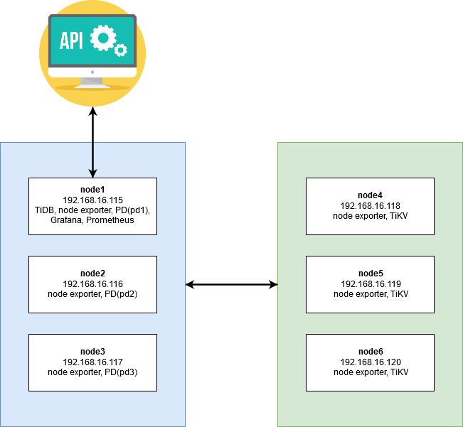

### Spesifikasi
node1 hingga node6 semuanya memiliki spesifikasi sebagai berikut:
- OS : geerlingguy/centOS7
- RAM : 512 MB
### Vagrant
1. Membuat file vagrant dengan mengetikkan
    ```
    vagrant init
    ```
2. Mengubah Vagrantfile menjadi seperti berikut
    ```ruby
    # -*- mode: ruby -*-
    # vi: set ft=ruby :

    Vagrant.configure("2") do |config|
        (1..6).each do |i|
        config.vm.define "node#{i}" do |node|
            node.vm.hostname = "node#{i}"

            # Gunakan CentOS 7 dari geerlingguy yang sudah dilengkapi VirtualBox Guest Addition
            node.vm.box = "geerlingguy/centos7"
            node.vm.box_version = "1.2.19"
            
            # Disable checking VirtualBox Guest Addition agar tidak compile ulang setiap restart
            node.vbguest.auto_update = false
            
            node.vm.network "private_network", ip: "192.168.16.#{i+114}"
            
            node.vm.provider "virtualbox" do |vb|
            vb.name = "node#{i}"
            vb.gui = false
            vb.memory = "512"
            end
    
            node.vm.provision "shell", path: "provision/bootstrap.sh", privileged: false
        end
        end
    end
    
    ```
3. Provisioning
    ```sh
    # Referensi:
    # https://pingcap.com/docs/stable/how-to/deploy/from-tarball/testing-environment/

    # Update the repositories
    # sudo yum update -y

    # Copy open files limit configuration
    sudo cp /vagrant/config/tidb.conf /etc/security/limits.d/

    # Enable max open file
    sudo sysctl -w fs.file-max=1000000

    # Copy atau download TiDB binary dari http://download.pingcap.org/tidb-v3.0-linux-amd64.tar.gz
    cp /vagrant/installer/tidb-v3.0-linux-amd64.tar.gz .

    # Extract TiDB binary
    tar -xzf tidb-v3.0-linux-amd64.tar.gz

    # Install MariaDB to get MySQL client
    sudo yum -y install mariadb

    # Install Git
    sudo yum -y install git

    # Install nano text editor
    sudo yum -y install nano

    # Install node exporter
    wget https://github.com/prometheus/node_exporter/releases/download/v0.18.1/node_exporter-0.18.1.linux-amd64.tar.gz
    tar -xzf node_exporter-0.18.1.linux-amd64.tar.gz
    ```

4. Menjalan kan vagrant
    ```
    vagrant up
    ```
5. Konfigurasi TiDB,  sesuai dengan file Running TIDB.txt
    <br>
    Pertama, masuk terlebih dahulu ke dalam node menggunakan command
    ```
    vagrant ssh node#i
    ```
    Lalu jalankan perintah berikut berurutan sesuai node nya
    ```
    Run on PD Server
    node1
    ./bin/pd-server --name=pd1 \
                    --data-dir=pd \
                    --client-urls="http://192.168.16.115:2379" \
                    --peer-urls="http://192.168.16.115:2380" \
                    --initial-cluster="pd1=http://192.168.16.115:2380, pd2=http://192.168.16.116:2380, pd3=http://192.168.16.117:2380" \
                    --log-file=pd.log &

    node2                
    ./bin/pd-server --name=pd2 \
                    --data-dir=pd \
                    --client-urls="http://192.168.16.116:2379" \
                    --peer-urls="http://192.168.16.116:2380" \
                    --initial-cluster="pd1=http://192.168.16.115:2380, pd2=http://192.168.16.116:2380, pd3=http://192.168.16.117:2380" \
                    --log-file=pd.log &
    node3                
    ./bin/pd-server --name=pd3 \
                    --data-dir=pd \
                    --client-urls="http://192.168.16.117:2379" \
                    --peer-urls="http://192.168.16.117:2380" \
                    --initial-cluster="pd1=http://192.168.16.115:2380, pd2=http://192.168.16.116:2380, pd3=http://192.168.16.117:2380" \
                    --log-file=pd.log &
    ======================================================

    Run on Tikv Server
    node4
    ./bin/tikv-server --pd="192.168.16.115:2379,192.168.16.116:2379,192.168.16.117:2379" \
                    --addr="192.168.16.118:20160" \
                    --data-dir=tikv \
                    --log-file=tikv.log &
    ./bin/tikv-server --pd="192.168.16.115:2379,192.168.16.116:2379,192.168.16.117:2379" \
                    --addr="192.168.16.118:20160" \
                    --data-dir=tikv \
                    --log-file=tikv.log &

    node5
    ./bin/tikv-server --pd="192.168.16.115:2379,192.168.16.116:2379,192.168.16.117:2379" \
                    --addr="192.168.16.119:20160" \
                    --data-dir=tikv \
                    --log-file=tikv.log &

    node6
    ./bin/tikv-server --pd="192.168.16.115:2379,192.168.16.116:2379,192.168.16.117:2379" \
                    --addr="192.168.16.120:20160" \
                    --data-dir=tikv \
                    --log-file=tikv.log &

    ======================================================

    Run on TiDB Server
    ./bin/tidb-server --store=tikv \
                    --path="192.168.16.115:2379" \
                    --log-file=tidb.log &

    ```

## Pemanfaatan Basis Data Terdistribusi dalam Aplikasi
Aplikasi yang digunakan disini adalah aplikasi lpencerdas yang dibuat Lab Pemrograman 1 Informatika ITS. Langkah-langkah deploy:
1. Membuat user untuk database lalu membuat database-nya.
    ```sh    
    mysql -u root -h 192.168.16.115 -P 4000 -e "create user if not exists 'user'@'%' identified by 'password'; grant all privileges on lpencerdas.* to 'user'@'%'; flush privileges;";
    mysql -u user -h 192.168.16.115 -P 4000 -p
    ```
    ```sql
    CREATE DATABASE lpencerdas;
    ```

2. Instalasi LPencerdas
    ```sh
    git clone https://github.com/lpif/lpencerdas.git
    composer install
    composer dump-autoload
    cp .env.example .env
    php artisan key:generate
    ```

3. Mengubah .env menjadi seperti berikut
    ```
    DB_CONNECTION=mysql
    DB_HOST=192.168.16.115
    DB_PORT=6033
    DB_DATABASE=lpencerdas
    DB_USERNAME=user
    DB_PASSWORD=password
    ```

4. Install tidb-laravel milik evvo sesuasi dengan petunjuk di [sini](https://github.com/evvo/tidb-laravel)

### Create

### Read
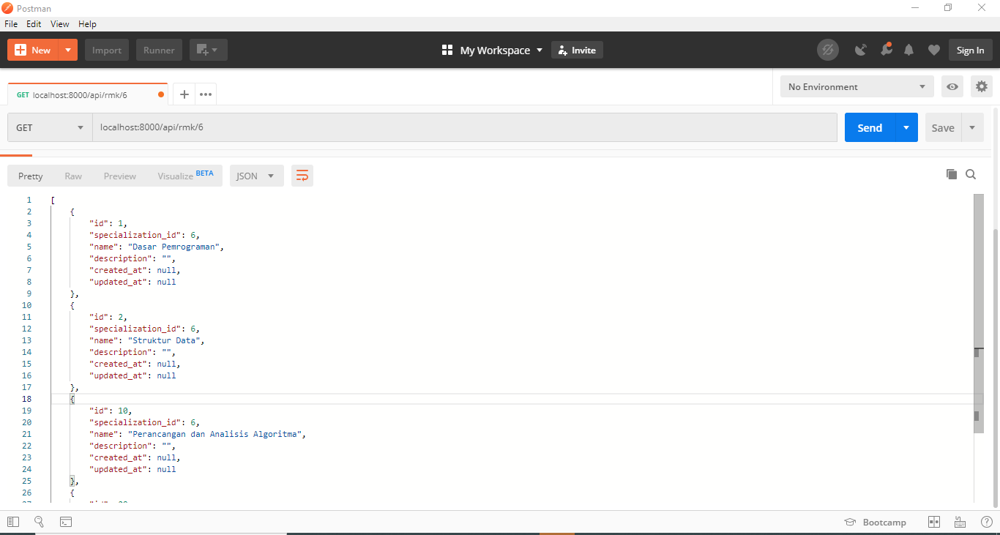
### Update
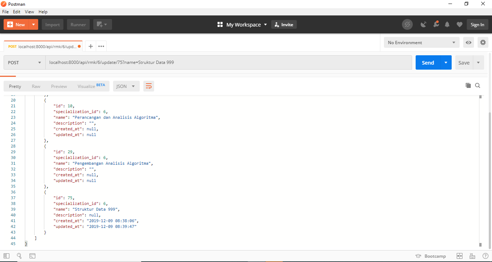
### Delete
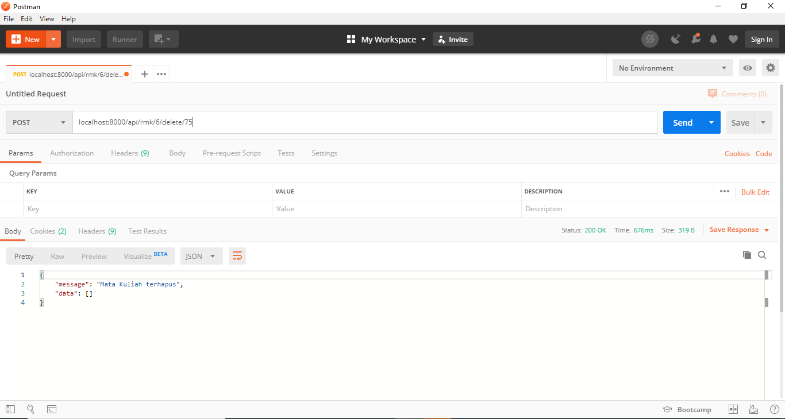

## Uji Performa Aplikasi dan Basis Data
### JMeter
* 100 Koneksi
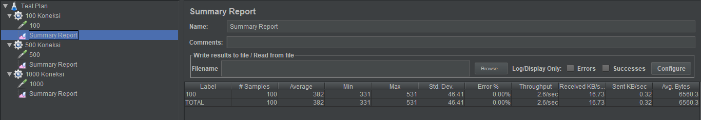
* 500 Koneksi
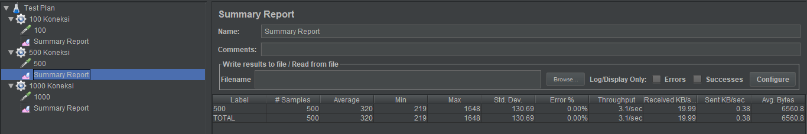
* 1000 Koneksi
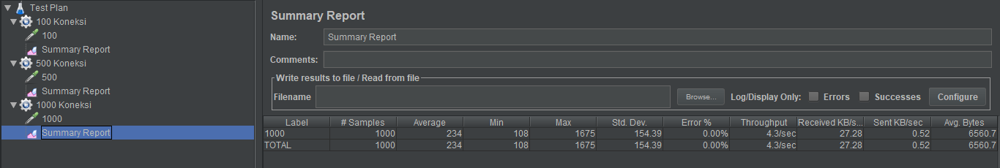

### Sysbench
1. Instalasi
    ```sh
    curl -s https://packagecloud.io/install/repositories/akopytov/sysbench/script.rpm.sh | sudo bash    
    sudo yum -y install sysbench
    git clone https://github.com/pingcap/tidb-bench.git
    cd tidb-bench/sysbench
    ```
2. Penggunaan
    1. Ubah file config dengan mengganti host dan db sesuai dengan database tidb
    ```sh
    nano config
    ```
    2. Jalankan script persiapan
    ```sh
    ./run.sh point_select prepare 100
    ```
    3. Jalankan script sysbench
    ```sh
    ./run.sh point_select run 100
    ```

* Hasil Uji Coba
    1. Dengan 3 PD<br>
        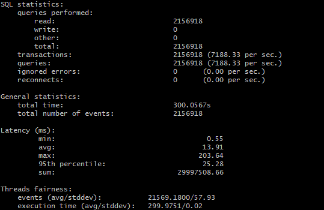
    2. Dengan 2 PD<br>
        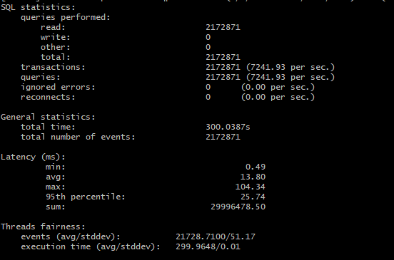
    3. Dengan 1 PD<br>
        

### Uji Fail Over
1. Masuk ke salah satu node dan ketik
    ```
    curl 192.168.16.115/pd/api/v1/members
    ```
    akan menampilkan<br>
    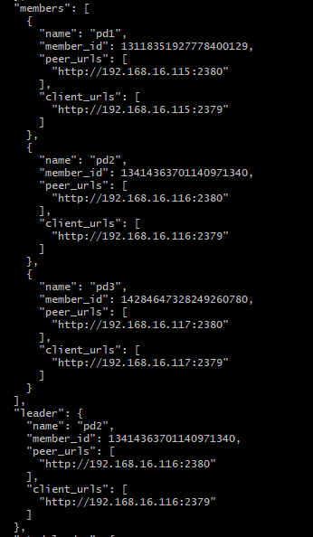

    Dapat dilihat bahwa saat ini leader dari cluster adalah PD2.
2. Matikan PD2 dengan cara meng-kill proses tersebut pada node2
    ```
    ps -aux | grep pd
    kill <pid>
    ```
3. Jalankan lagi 
    ```
    curl 192.168.16.115/pd/api/v1/members
    ```
    akan menampilkan<br>
    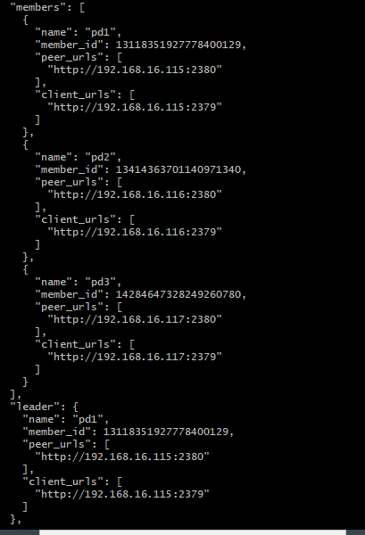

    Dapat dilihat bahwa leader sudah berubah menjadi PD1

## Monitoring Dashboard Menggunakan Grafana
Di sini, dashboard yang digunakan ada 3 jenis yaitu `tidb.json`, `pd.json`, serta `tikv-details.json`<br>
Untuk file-nya dapat diambil dari [github pingcap/tidb](https://github.com/pingcap/tidb-ansible/tree/master/scripts)

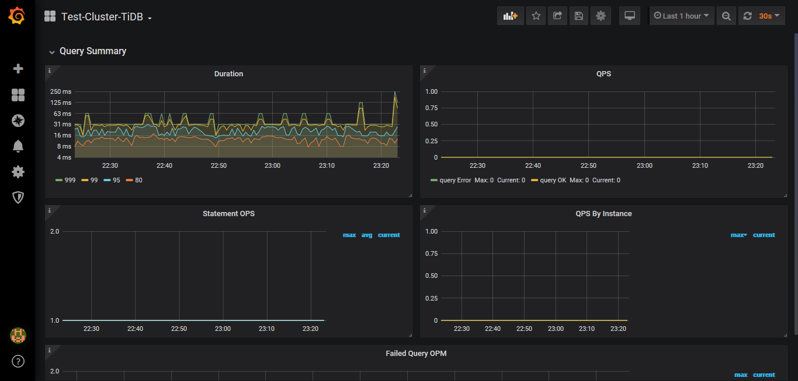<br>
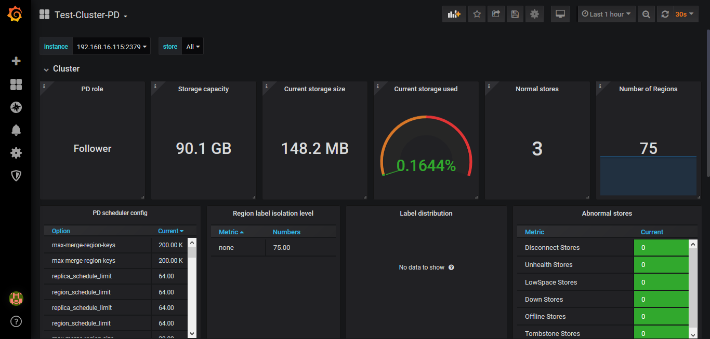<br>
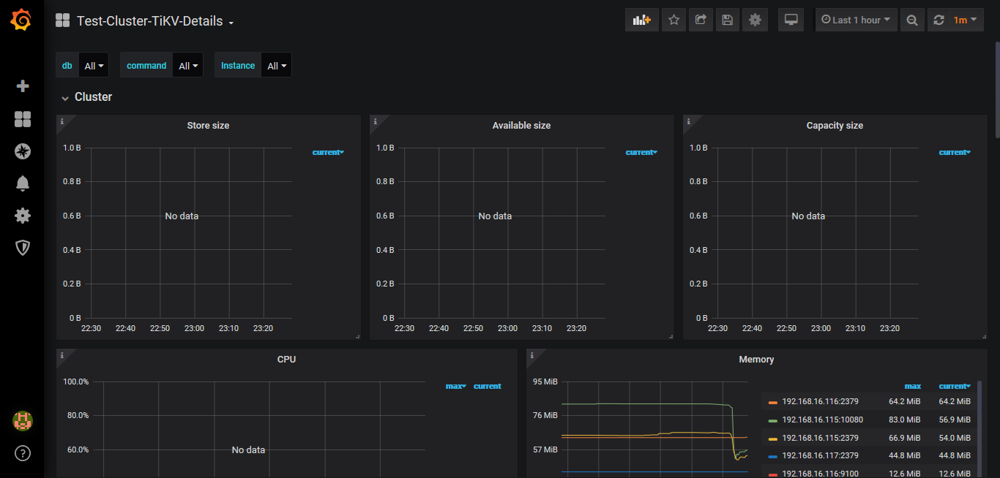<br>