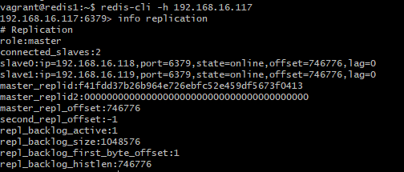

# Redis Cluster
Nama: Dewi Ayu Nirmalasari<br>
NRP: 05111640000115

## Content

## Implementasi Redis Cluster
### 1. Pembagian IP dan Spesifikasinya
1. Server wordpress, ada 2 buah:
    - wordpress1
        - OS: ubntu-18.04
        - RAM: 512 MB
        - IP: 192.168.16.115
    - wordpress2
        - OS: ubntu-18.04
        - RAM: 512 MB
        - IP: 192.168.16.116
2. Server redis, ada 3 buah:
    - redis1
        - OS: ubntu-18.04
        - RAM: 512 MB
        - IP: 192.168.16.117
    - redis2
        - OS: ubntu-18.04
        - RAM: 512 MB
        - IP: 192.168.16.118
    - redis3
        - OS: ubntu-18.04
        - RAM: 512 MB
        - IP: 192.168.16.119

### 2. Vagrant
1. Menjalankan
    ```
    vagrant init
    ```
2. Memodifikasi `Vagrantfile`
    ```ruby
    # -*- mode: ruby -*-
    # vi: set ft=ruby :

    # All Vagrant configuration is done below. The "2" in Vagrant.configure
    # configures the configuration version (we support older styles for
    # backwards compatibility). Please don't change it unless you know what
    # you're doing.
    Vagrant.configure("2") do |config|

        (1..2).each do |i|
            config.vm.define "wordpress#{i}" do |node|
                node.vm.hostname = "wordpress#{i}"
                node.vm.box = "bento/ubuntu-18.04"
                node.vm.network "private_network", ip: "192.168.16.#{114+i}"

                node.vm.provider "virtualbox" do |vb|
                    vb.name = "wordpress#{i}"
                    vb.gui = false
                    vb.memory = "512"
                end
                node.vm.provision "shell", path: "bash/wordpress.sh", privileged: false
            end
        end

        (1..3).each do |i|
            config.vm.define "redis#{i}" do |node|
            node.vm.hostname = "redis#{i}"
            node.vm.box = "bento/ubuntu-18.04"
            node.vm.network "private_network", ip: "192.168.16.#{116+i}"

            node.vm.provider "virtualbox" do |vb|
                vb.name = "redis#{i}"
                vb.gui = false
                vb.memory = "512"
            end

            node.vm.provision "shell", path: "bash/redis#{i}.sh", privileged: false
            end
        end
    end
    ```
3. Membuat provisioning<br>
    - Provision untuk `wordpress.sh`
        ```sh
        sudo cp /vagrant/sources/hosts /etc/hosts
        sudo cp '/vagrant/sources/sources.list' '/etc/apt/'

        sudo apt update -y

        # Install Apache2
        sudo apt install apache2 -y
        sudo ufw allow in "Apache Full"

        # Install PHP
        sudo apt install php libapache2-mod-php php-mysql php-pear php-dev -y
        sudo a2enmod mpm_prefork && sudo a2enmod php7.0
        sudo pecl install redis
        sudo echo 'extension=redis.so' >> /etc/php/7.2/apache2/php.ini

        # Install MySQL
        sudo debconf-set-selections <<< 'mysql-server mysql-server/root_password password admin'
        sudo debconf-set-selections <<< 'mysql-server mysql-server/root_password_again password admin'
        sudo apt install mysql-server -y
        sudo mysql_secure_installation -y
        sudo ufw allow 3306

        # Configure MySQL for Wordpress
        sudo mysql -u root -padmin < /vagrant/sql/wordpress.sql

        # Install Wordpress
        cd /tmp
        wget -c http://wordpress.org/latest.tar.gz
        tar -xzvf latest.tar.gz
        sudo mkdir -p /var/www/html
        sudo mv wordpress/* /var/www/html
        sudo cp /vagrant/wp-config.php /var/www/html/
        sudo chown -R www-data:www-data /var/www/html/
        sudo chmod -R 755 /var/www/html/
        sudo systemctl restart apache2
        ```
    - Provision untuk `redis1.sh`
        ```sh
        sudo cp /vagrant/sources/hosts /etc/hosts
        sudo cp '/vagrant/sources/sources.list' '/etc/apt/'

        sudo apt update -y

        sudo apt-get install build-essential tcl -y
        sudo apt-get install libjemalloc-dev -y

        curl -O http://download.redis.io/redis-stable.tar.gz
        tar xzvf redis-stable.tar.gz
        cd redis-stable
        make
        # make test
        sudo make install

        sudo mkdir /etc/redis

        sudo cp /vagrant/config/redis1.conf /etc/redis/redis.conf
        sudo cp /vagrant/config/sentinel1.conf /etc/redis-sentinel.conf

        sudo cp /vagrant/service/redis.service /etc/systemd/system/redis.service
        sudo cp /vagrant/service/redisentinel.service /etc/systemd/system/redisentinel.service

        sudo adduser --system --group --no-create-home redis
        sudo mkdir /var/lib/redis
        sudo chown redis:redis /var/lib/redis
        sudo chmod 770 /var/lib/redis

        sudo systemctl start redis
        sudo systemctl status redis

        sudo chmod 777 /etc/redis-sentinel.conf
        sudo systemctl start redisentinel
        sudo systemctl status redisentinel
        ```

    - Provision untuk `redis2.sh`
        ```sh
        sudo cp /vagrant/sources/hosts /etc/hosts
        sudo cp '/vagrant/sources/sources.list' '/etc/apt/'

        sudo apt update -y

        sudo apt-get install build-essential tcl -y
        sudo apt-get install libjemalloc-dev -y

        curl -O http://download.redis.io/redis-stable.tar.gz
        tar xzvf redis-stable.tar.gz
        cd redis-stable
        make
        # make test
        sudo make install

        sudo mkdir /etc/redis

        sudo cp /vagrant/config/redis2.conf /etc/redis/redis.conf
        sudo cp /vagrant/config/sentinel2.conf /etc/redis-sentinel.conf

        sudo cp /vagrant/service/redis.service /etc/systemd/system/redis.service
        sudo cp /vagrant/service/redisentinel.service /etc/systemd/system/redisentinel.service

        sudo adduser --system --group --no-create-home redis
        sudo mkdir /var/lib/redis
        sudo chown redis:redis /var/lib/redis
        sudo chmod 770 /var/lib/redis

        sudo systemctl start redis
        sudo systemctl status redis

        sudo chmod 777 /etc/redis-sentinel.conf
        sudo systemctl start redisentinel
        sudo systemctl status redisentinel

        sudo chmod -R 777 /etc/redis
        sudo systemctl restart redis
        sudo systemctl status redis
        ```
    - Provision untuk `redis3.sh`
        ```sh
        sudo cp /vagrant/sources/hosts /etc/hosts
        sudo cp '/vagrant/sources/sources.list' '/etc/apt/'

        sudo apt update -y

        sudo apt-get install build-essential tcl -y
        sudo apt-get install libjemalloc-dev -y

        curl -O http://download.redis.io/redis-stable.tar.gz
        tar xzvf redis-stable.tar.gz
        cd redis-stable
        make
        # make test
        sudo make install

        sudo mkdir /etc/redis

        sudo cp /vagrant/config/redis2.conf /etc/redis/redis.conf
        sudo cp /vagrant/config/sentinel2.conf /etc/redis-sentinel.conf

        sudo cp /vagrant/service/redis.service /etc/systemd/system/redis.service
        sudo cp /vagrant/service/redisentinel.service /etc/systemd/system/redisentinel.service

        sudo adduser --system --group --no-create-home redis
        sudo mkdir /var/lib/redis
        sudo chown redis:redis /var/lib/redis
        sudo chmod 770 /var/lib/redis

        sudo systemctl start redis
        sudo systemctl status redis

        sudo chmod 777 /etc/redis-sentinel.conf
        sudo systemctl start redisentinel
        sudo systemctl status redisentinel

        sudo chmod -R 777 /etc/redis
        sudo systemctl restart redis
        sudo systemctl status redis
        ```

4. Konfigurasi
    - `redis1.conf` dan `sentinel1.conf`
        ```
        bind 192.168.16.117
        port 6379
        dir "/etc/redis"
        ```
        ```
        bind 192.168.16.117
        port 26379

        sentinel monitor redis-cluster 192.168.16.117 6379 2
        sentinel down-after-milliseconds redis-cluster 5000
        sentinel parallel-syncs redis-cluster 1
        sentinel failover-timeout redis-cluster 10000
        ```
    - `redis2.conf` dan `sentinel2.conf`
        ```
        bind 192.168.16.118
        port 6379
        dir "/etc/redis"
        slaveof 192.168.16.117 6379
        ```
        ```
        bind 192.168.16.118
        port 26379

        sentinel monitor redis-cluster 192.168.16.117 6379 2
        sentinel down-after-milliseconds redis-cluster 5000
        sentinel parallel-syncs redis-cluster 1
        sentinel failover-timeout redis-cluster 10000
        ```
    - `redis3.conf` dan `sentinel3.conf`
        ```
        bind 192.168.16.119
        port 6379
        dir "/etc/redis"
        slaveof 192.168.16.117 6379
        ```
        ```
        bind 192.168.16.119
        port 26379

        sentinel monitor redis-cluster 192.168.16.117 6379 2
        sentinel down-after-milliseconds redis-cluster 5000
        sentinel parallel-syncs redis-cluster 1
        sentinel failover-timeout redis-cluster 10000
        ```
5. Membuka `redis1`, `redis2`, dan `redis3` melalui CLI lalu menjalankan 
    ```
    sudo chown redis:redis /etc/redis
    ```

Mengecek hasil clustering:<br>


## Instalasi WordPress
1. Ketik `192.168.16.115/index.php` dan `192.168.16.116/index.php` pada URL browser lalu ikuti langkah-langkah yang ada sesuai keinginan

2. Tambahan untuk `wordpress1`
    1. Login sesuai dengan username yang sudah dibuat sebelumnya
    2. Masuk ke dalam `Plugin` pada dashboard, lalu masuk ke `Plugin Baru`.
    3. Cari `Redis Object Cache`
    4. Tambahkan pada `/var/www/html/wp-config.php` pada server `wordpress1`:
        ```php
        define('FS_METHOD', 'direct');
        define('WP_REDIS_SENTINEL', 'redis-cluster');
        define('WP_REDIS_SERVERS', ['tcp://192.168.16.117:26379', 'tcp://192.168.16.118:26379', 'tcp://192.168.16.119:26379']);
        ```
    5. Pada `/var/www/html/wp-content/plugins/redis-cache/includes/predis/src/Command/ServerInfo.php` pada server `wordpress1` Ubah:
        ```php
        public function getId(){
            return 'info';
        }
        ```
    6. Aktifkan plugin `Redis Cache Object`
    <br>
    Pada bagian `Diagnostics`, akan seperti berikut.
    

## Pengujian Menggunakan JMeter
1. 50 Koneksi


2. 215 Koneksi


3. 315 Koneksi


## Simulasi Fail Over
1. Mematikan server master `redis1`:
    ```
    sudo systemctl stop redis
    sudo systemctl stop redisentinel
    ```
2. Masuk ke `redis2` dan `redis3` lalu mengecek replikasi dengan mengetik `info replication`
    
    

    Dari hasil screenshoot master telah berpindah pada server `redis2`